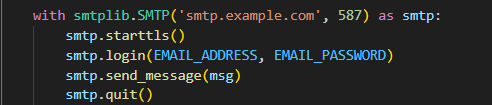

# **TELEFOX**
**TELEFOX**, Telegram üzerinden istihbarat çalışmalarında siber güvenlik ekiplerine yardımcı olmak amacıyla geliştirilen bir projedir. **TELEFOX**, son 24 saat içinde Telegram kanallarında paylaşılan mesajlardan önemli kelimeleri ayıklayarak bu mesajları anlık olarak e-posta yoluyla bildirmeyi hedefleyen bir projedir.

## Kurulum
1. **TELEFOX'u** bu repo üzerinden cihazınıza indirdikten sonra, öncelikle bağımlılıkların kurulması gerekmektedir. Bu işlem için aşağıdaki komut yardımcı olacaktır.

        pip install -r requirements.txt

2. Bağımlılıkların kurulumunda başarılı olduysanız eğer, "telefox.py" isimli dosyanın içerisine giriş yaparak aşağıda bulunan maddeler halinde verilmiş olan bilgilerin girişlerinin yapılması ve sonrasında kaydedilmesi gerekmektedir. Aşağıda belirtilmiş olan bilgileri [MyTelegramAPI](https://my.telegram.org/auth) adresi üzerinden edinmeniz gerekmektedir
    - api_id
    - api_hash
    - phone

3. Bu adımı da tamamladıktan sonra yine aynı dosya içerisinde "htmlMail" isimli fonksiyonu bulmanız gerekmektedir. Bu fonksiyon içerisinde aşağıda maddeler halinde belirtilmiş olan kısımlara, uygulamanın mail bildirimlerini yapabilmesi için gerekli olan bilgileri girmeniz gerekmektedir. Google gibi bir mail hizmeti kullanacaksanız eğer, hesabınızda uygulama şifresi oluşturmanız gerekecektir. Bunun için bu doküman yardımcı olacaktır. [Google Uygulama Şifresi](https://knowledge.workspace.google.com/kb/how-to-generate-an-app-passwords-000009237?hl=tr)
    
    - EMAIL_ADDRESS
    - EMAIL_PASSWORD
    - TO_EMAIL
    - Ve son olarak, aşağıdaki görselde belirtilmiş olan alanı bulup, maillerin gönderileceği mail sunucusunun SMTP bilgilerini girmeniz gerekmektedir. Bu adımdan sonra artık **TELEFOX** kullanıma hazır bir durumu gelmiş olacaktır.

    